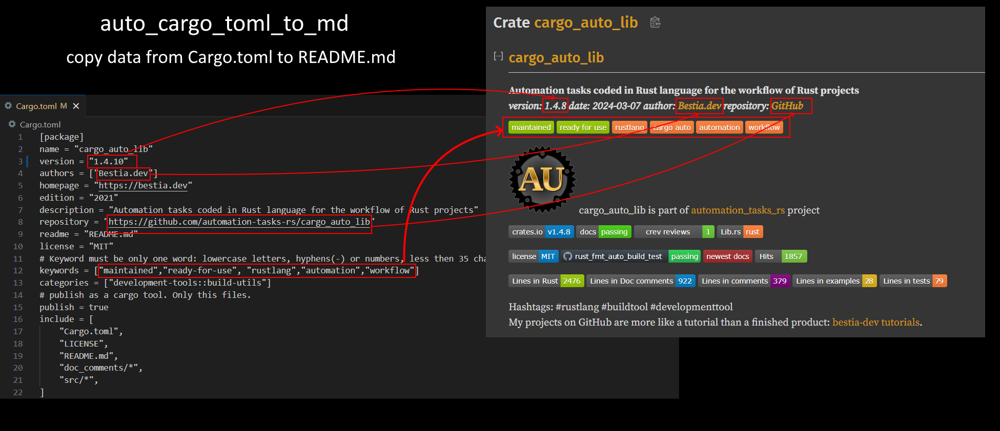

[comment]: # (auto_md_to_doc_comments segment start A)

# cargo_auto_lib

[comment]: # (auto_cargo_toml_to_md start)

**Library crate for common tasks when building rust projects. Intended for use with cargo-auto: automation tasks written in Rust language.**  
***[repository](https://github.com/LucianoBestia/cargo_auto_lib); version: 0.7.4  date: 2021-08-15 authors: Luciano Bestia***  

[comment]: # (auto_cargo_toml_to_md end)

[comment]: # (auto_lines_of_code start)
[](https://github.com/LucianoBestia/cargo_auto_lib/)
[](https://github.com/LucianoBestia/cargo_auto_lib/)
[](https://github.com/LucianoBestia/cargo_auto_lib/)
[](https://github.com/LucianoBestia/cargo_auto_lib/)
[](https://github.com/LucianoBestia/cargo_auto_lib/)

[comment]: # (auto_lines_of_code end)

[](https://crates.io/crates/cargo_auto_lib) [](https://docs.rs/cargo_auto_lib/) [](https://web.crev.dev/rust-reviews/crate/cargo_auto_lib/) [](https://lib.rs/crates/cargo_auto_lib/) [](https://github.com/LucianoBestia/cargo_auto_lib/blob/master/LICENSE) [](https://github.com/LucianoBestia/cargo_auto_lib/)  

## Try it

In your rust project root directory (where the Cargo.toml is)  
first install [cargo-auto](https://crates.io/crates/cargo-auto) and generate a new helper project:

```bash
cargo install cargo-auto
cargo auto new with_lib
```

In a new editor open the generated directory `automation_tasks_rs` as an independent rust project. There is already this dependency in `Cargo.toml`:  

```toml
cargo_auto_lib="0.7.4"
```

Preview the code and observe all the `auto_*` functions from `cargo_auto_lib`.  
Example:  

```rust
fn task_release() {
    // semver is used for libraries, version_from_date is used for binary
    auto_semver_increment_patch();
    //auto_version_from_date();
    auto_cargo_toml_to_md();
    auto_lines_of_code("");
}
```

Go back to your main rust project.  
Add markers to the beginning of README.md (don't copy the numbers 1 and 2):  

```md
1 [comment]: # (auto_cargo_toml_to_md start)
2 [comment]: # (auto_cargo_toml_to_md end)
```

Run (in your main rust project):

```bash
cargo auto build
```

With a little luck, it included the data of Cargo.toml into the `README.md` inside the markers: description, repository, version, &utc_now(), authors  



## Caveats

This crate will attempt to edit Cargo.toml. Unfortunately there's no great robust way right now to edit TOML file preserving formatting and comments and such, so right now I use just regex to do this.

If you find that the heuristics don't work for you though please let me know and I'll try to check in a fix!

# function auto_cargo_toml_to_md()

To avoid out of sync data like version, authors and description in the README.md files, `auto_cargo_toml_to_md` includes this data from Cargo.toml.  
Run it on every build with [cargo auto](https://crates.io/crates/cargo-auto).  

It works only for single projects and not for workspaces yet.  
It works also with other md files in the project, not only README.md.  
In the md file write these markers in markdown comments (invisible),  
don't copy the numbers 1 and 2:  

```markdown
1 [comment]: # (auto_cargo_toml_to_md start)
2 [comment]: # (auto_cargo_toml_to_md end)
```

`auto_cargo_toml_to_md` deletes the old lines between the markers and includes the Cargo.toml data:  
description, repository, version, &utc_now(), authors  

Run the example:  

```bash
cargo run --example example_01_auto_cargo_toml_to_md
```

# function auto_md_to_doc_comments()

Includes segments of md files into rs files as doc comments.  
From this doc comments `cargo doc` will generated the documentation and auto-completion.  
We don't want to manually copy this segments. We want them to be automatically in sync.  
We will just run this function before every `cargo doc` with an automation task.  
The `auto_md_to_doc_comments` function must be executed in the project root folder where is the Cargo.toml file.  
TODO: It does not work in workspace folder, but every single member project must call it separately.  
First it searches all the rs files in src, tests and examples folders.  
If they contain the markers, than finds the md file and the named segment and include it as doc comments into the rs file.  
The markers are always in pairs: start and end. So exactly the content in between is changed.
The markers are always comments, so they don't change the code.  
It works only for files with LF line delimiter. No CR and no CRLF.  

## markers

In the rs file write these markers (don't copy the numbers 1 and 2):  

```rust
1. // region: auto_md_to_doc_comments include README.md //! A  
2. // endregion: auto_md_to_doc_comments include README.md //! A  
```

In the md file put markers to mark the segment:  

```markdown
1. [comment]: # (auto_md_to_doc_comments segment start A)  
2. [comment]: # (auto_md_to_doc_comments segment end A)  
```

The marker must be exclusively in one line. No other text in the same line.  
auto_md_to_doc_comments will delete the old lines between the markers.  
It will find the md file and read the content between the markers.  
Before each line it will add the doc comment symbol as is defined in the marker.  
Finally it will include the new lines as doc comments in the rs file.  

# function auto_semver_increment_patch()

Increments the patch version in Cargo.toml file.

# function auto_semver_increment_minor()

Increments the minor version in Cargo.toml file.

# function auto_version_from_date()

In Cargo.toml writes the version as the date `yyyy.mmdd.HHMM` ex. `2019.1221.2359`.  
For non-library projects, the semver specification is not really useful.  
Having the version as the date is just fine for executables and much more human readable.  
The function must be executed in the root project folder where is the Cargo.toml.  

## service_worker.js

Inside the PWA service worker javascript file is also needed to change the version.  
The program searches for `service_worker.js` and modify the version.  

## no need to change version if no files changed

If src/*.rs or Cargo.toml files are not changed from last compile,
than no need to change version.  
It does not support workspaces yet.  
The dates of the files will be stored in target folder as auto_version_from_date.json.
Warning: I don't check if the service worker has changed because it rarely does.  

# function auto_lines_of_code()

Lines of code are not a "perfect" measurement of anything.\
Anybody can write a very big number of lines of useless code and comments.\
But for 95% of the cases they are good enough.\
Most of the developers use some "standard" coding practices and that is quantifiable and comparable.  

The `src_code_lines` is the most important count.\
That is actual code written for that project without  doc comments, comments, unit tests, integration tests and examples.\
Sometimes is great to see a big number here. It means there was a lot of work invested. But other times we want to see a small number. It means the developer understands the problem very well and don't try to solve anything outside that scope.  

The `src_doc_comment_lines` counts doc comments. They will eventually become docs. The count of lines shows how many documentation is written.  

The `src_comment_lines` counts code comments. Code comments are important to understand the code. The count of lines shows how understandable is the code.  

The `tests_lines` counts lines in tests and shows how good is the code tested. Here are the unit tests and integration test combined.  

The `examples_lines` counts lines in examples and shows how good is explained how to use the code.  

## Folder and file structure

The folder structure of a single Rust project is simple.\
The project starts in the folder that contains `Cargo.toml`.\
The `src/` folder contains all the rust `*.rs` files.\
The `tests/` folder contains integration tests.\
The `examples/` folder contains examples.\
Inside a rs file the doc comment line start with `///` or `//!`.\
The normal comments start with `//` or `/!`.\
I will ignore the block comments. They are usually NOT used for comments, but to temporarily disable a piece of code. So I count this as code and not comments.  

The `src/*.rs` file can contain unit tests that start with `#[cfg(test)]`. I assume that these are always at the end of the file. There should not be any normal code after `#[cfg(test)]`, only tests.  

All other files: `md`, `toml`, `html`, `js`, ... are not counted.  

### Workspace

Workspaces have member projects, that are written in `Cargo.toml`.\
The program counts lines of every project and sums them together.  

## Output

The output is markdown text for shield badges.\
The only parameter `link` will be used for the link of all 4 shield badges.  
Else the app will try `git remote -v` to get the remote url.  

## Include into README.md

If the README.md file contains these markers (don't copy the numbers 1 and 2):  

1. `[comment]: # (auto_lines_of_code start)`  
2. `[comment]: # (auto_lines_of_code end)`  

the function will include the shield badges code between them.  
It will erase the previous content.  
Use git diff to see the change.  

## Testing

Testing is difficult, because I use this own project to get the lines of code for the tests.  
These will change as the code is modified. Moreover, the result from `$ git remote -v` is different on different computers. To align with this changes, the testing has 2 const that must be manually updated to contain the actual data.  
Testing will also modify the `README.md` file. Always after testing run `cargo make doc` to correct the `README.md`. Or just revert it using git.  

## References

<https://blog.burntsushi.net/rust-error-handling/>

# function auto_delete_old_js_snippets()

The old folders for `js snippets` are not automatically deleted on building with `wasm-pack`.  
This utils do that.
The function must be executed in the root project folder where is the Cargo.toml.  

## cargo crev reviews and advisory

We leave in times of danger with `supply chain attacks`.  
It is recommended to always use [cargo-crev](https://github.com/crev-dev/cargo-crev)  
to verify the trustworthiness of each of your dependencies.  
Please, spread this info.  
You can also read reviews quickly on the web. Example for the crate `num-traits`:  
<https://web.crev.dev/rust-reviews/crate/num-traits/>  

## open-source free and free as a beer

My open-source projects are free and free as a beer (MIT license).  
I just love programming.  
But I need also to drink. If you find my projects and tutorials helpful, please buy me a beer or two donating on my [paypal](https://www.paypal.com/paypalme/LucianoBestia). You know the price of a beer in your local bar ;-)  
So I can drink a free beer for your health :-)  
[Na zdravje](https://translate.google.com/?hl=en&sl=sl&tl=en&text=Na%20zdravje&op=translate) !

[comment]: # (auto_md_to_doc_comments segment end A)
