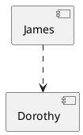
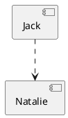

# Input Markdown file for plantuml examples

before first blah blah
this has not yet the image link

[//]: # (auto_plantuml start)

[//]: # (auto_plantuml end)

after first blah blah

before second blah blah
this already has the image link

[//]: # (auto_plantuml start)

[//]: # (auto_plantuml end)

after second blah blah
